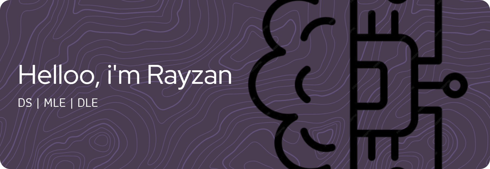

<!--  -->

<!-- -
-
-
##### Skills

##### Librarys

 -->

<!-- # 💫 About Me:
Kalau teks yang kamu tulis masih agak terasa ke arah belajar Data Science, Jan. Kalau mau lebih condong ke Machine Learning / AI Engineer, bisa dipoles biar fokusnya ke membangun model, sistem, dan aplikasi AI. Aku bikinin versi revisi yang balance antara “lagi belajar” tapi tetap nunjukin arah ke ML/AI Engineer:

---

Hi there 👋    

I'm Rayzan, an aspiring Machine Learning & AI Engineer exploring how intelligent systems can solve real-world problems.   
💡 I enjoy designing, training, and optimizing models — from turning raw data into insights to deploying AI-powered applications.   
🌱 Right now, I’m focused on:  

Strengthening my fundamentals in Machine Learning & Deep Learning  

Experimenting with data preprocessing, model building, and evaluation  

Learning how to deploy and scale models in real-world environments   
🚀 My goal is to grow into a skilled ML/AI Engineer with a solid foundation in Data Science and practical AI development.   
📫 Let’s connect and share knowledge about AI, ML, and beyond!  

## 🌐 Socials:
  

# 💻 Tech Stack:
        
# 📊 GitHub Stats:
 
 

### 🔝 Top Contributed Repo

---
 -->

<!-- Proudly created with GPRM ( https://gprm.itsvg.in ) -->

  

  
  

###

  

###

<h1 align="center">hey there 👋</h1>

###

<h3 align="left">👩‍💻  About Me</h3>

###

I'm Rayzan 👋  
Right now I'm diving into the world of **Machine Learning, Deep Learning, and Data Science**.  
I love exploring data, finding cool insights, and building models that can actually solve real problems.  

🌱 Currently learning and focusing on:  
- Getting a solid grasp of ML & DL fundamentals  
- Playing around with data preprocessing and model building  
- Figuring out how to bring models into real-world apps  

💡 My goal is to grow into a **Machine Learning Engineer** with a strong base in **Data Science**.  

📫 Always open to connect, chat, and share knowledge!

###

<h3 align="left">🛠 TechStack</h3>

###

 
 
 
 
 
 
 
 
 

###

<h3 align="left">🔥   My Stats :</h3>

###

  

###

<h3 align="left">😋Try it out </h3>

  

🌀 this is one of the projects I made, It's called **NPC Maze Solver** — a fun AI project where an NPC tries to escape a maze by finding the smartest route.  
It explores, keeps track of different paths, and learns which one is the most efficient.  

👉 For the full details, check it out on my [repositories!](https://github.com/Janlearns/MiniProject)

