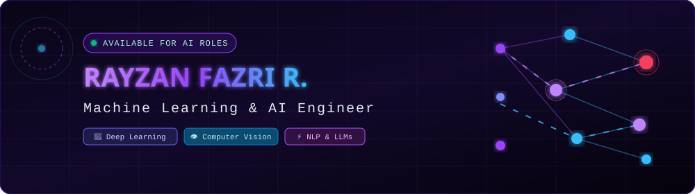
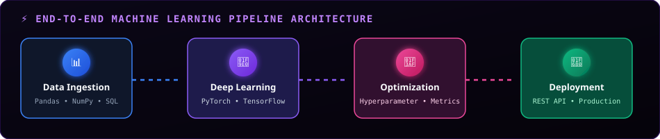

<!-- CUSTOM CYBERPUNK NEURAL HEADER BANNER -->

  

<!-- TYPING SVG ANIMATION -->

  

<!-- SOCIAL BADGES & METRICS HUB -->

&nbsp;

&nbsp;

&nbsp;

&nbsp;

 

<!-- DIVIDER -->

## 🚀 &nbsp;About Me

<table width="100%">
  <tr>
    <td width="72%" valign="top">
      
I am an aspiring <b>Machine Learning &amp; AI Engineer</b>, passionate about transforming raw data into intelligent, scalable solutions. My focus lies in designing robust models, optimizing algorithms, and bridging the gap between theoretical AI and real-world impact.

      <ul>
        <li>🤖 &nbsp;<b>Current Focus:</b> Deep Learning, Neural Architecture Design &amp; Autonomous Agents</li>
        <li>🌱 &nbsp;<b>Core Competencies:</b> Data Preprocessing, Feature Engineering &amp; Hyperparameter Optimization</li>
        <li>⚡ &nbsp;<b>Application:</b> Integrating ML/DL models into production-ready software systems</li>
        <li>🎯 &nbsp;<b>Vision:</b> Full-Stack Machine Learning Systems (Data Pipeline &rarr; Model &rarr; Deployment &rarr; Monitoring)</li>
      </ul>
      
💬 Open to collaborations and discussions on Artificial Intelligence and Data Science!

    </td>
    <td width="28%" align="center" valign="middle">
      
    </td>
  </tr>
</table>

<!-- DIVIDER -->

## ⚡ &nbsp;End-to-End ML Pipeline Architecture

  

<!-- DIVIDER -->

## 🛠️ &nbsp;Tech Stack & Technical Proficiency

  

#### ⚡ Quick Tech Stack Badges

<!-- DIVIDER -->

## 📊 &nbsp;GitHub Analytics & Streak

<table width="100%">
  <tr>
    <td width="50%" align="center" valign="top">
      
    </td>
    <td width="50%" align="center" valign="top">
      
    </td>
  </tr>
</table>

 

  

<!-- DIVIDER -->

## 📈 &nbsp;Developer Productivity Metrics

<table width="100%">
  <tr>
    <td width="50%" align="center">
      
    </td>
    <td width="50%" align="center">
      
    </td>
  </tr>
</table>

<table width="100%">
  <tr>
    <td width="33.3%" align="center">
      
    </td>
    <td width="33.3%" align="center">
      
    </td>
    <td width="33.3%" align="center">
      
    </td>
  </tr>
</table>

<!-- DIVIDER -->

## 🧩 &nbsp;Featured Project: NPC Maze Solver

  

 

<b>NPC Maze Solver</b> demonstrates an AI agent capable of autonomous pathfinding. The agent explores the environment, analyzes potential routes, and optimizes for the most efficient path to escape the maze.

#### 🧠 Neural Core Architecture

  

 

👉 &nbsp;Explore implementation code in the **[MiniProject Repository](https://github.com/Janlearns/MiniProject)**

<!-- DIVIDER -->

## 🐍 &nbsp;Contribution Animations

<!-- SNAKE ANIMATION -->
<picture>
  <source media="(prefers-color-scheme: dark)" srcset="https://raw.githubusercontent.com/Janlearns/Janlearns/output/snake.svg" />
  <source media="(prefers-color-scheme: light)" srcset="https://raw.githubusercontent.com/Janlearns/Janlearns/output/snake.svg" />
  
</picture>

  

<!-- DIVIDER -->

<!-- FOOTER -->
 

