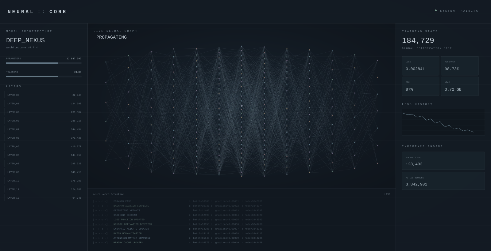

<table width="100%" bgcolor="#070B18">
<tr>
<td>

  

  

  
  
  
  

  
  
  

 

  

<h3 align="center">🧬 About Me</h3>

💡 I am an aspiring **Machine Learning & AI Engineer** focused on turning raw data into intelligent and scalable systems.
🚀 I build practical AI workflows across **Deep Learning**, **NLP**, **RAG systems**, and **AI agents**.
🎯 My goal is to become a full-stack ML engineer who can design, train, deploy, and monitor end-to-end AI products.

<h3 align="center">🛠️ Tech Stack</h3>

  

  
  
  
  

<h3 align="center">📈 Stats & Activity</h3>

  

  

 

  

 

  

<h3 align="center">🌌 AI Quote of the Moment</h3>

  

<h3 align="center">🧩 Featured Project · NPC Maze Solver</h3>

  

**NPC Maze Solver** showcases an autonomous AI agent that explores maze states, evaluates routes, and searches efficient escape paths.
A compact demonstration of intelligent navigation and game-agent behavior.

  
  

<h3 align="center">🧠 Neural Core</h3>

  

  

</td>
</tr>
</table>
