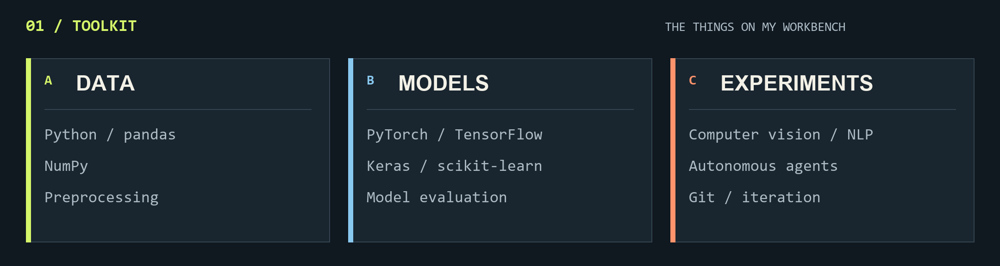
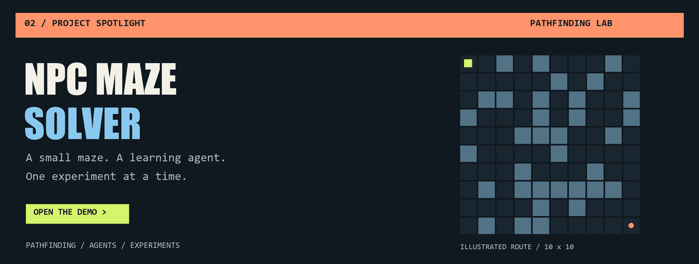
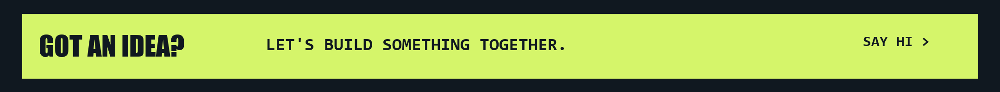



  <a href="mailto:rayzanfazri@gmail.com"><b>EMAIL ↗</b></a> &nbsp; &nbsp; / &nbsp; &nbsp;
  <a href="https://www.linkedin.com/in/rayzan-fazri-ramdany-190063291"><b>LINKEDIN ↗</b></a> &nbsp; &nbsp; / &nbsp; &nbsp;
  <a href="https://www.instagram.com/rayzan3_0"><b>INSTAGRAM ↗</b></a> &nbsp; &nbsp; / &nbsp; &nbsp;
  <a href="https://github.com/Janlearns?tab=repositories"><b>REPOSITORIES ↗</b></a>

### Hey, I'm Rayzan 👋

I'm learning to build machine learning systems, from preparing the data to making a model work inside an application. Here you'll find my experiments with **deep learning, computer vision, NLP, and agents**.

<table>
<tr>
<td width="50%" valign="top">

**↳ Currently exploring**

Neural networks, model evaluation, and how agents learn through interaction.

</td>
<td width="50%" valign="top">

**↳ Working toward**

Connecting the pieces: data → training → evaluation → a usable application.

</td>
</tr>
</table>

 

### A maze, an agent, and a lot of attempts.

**NPC Maze Solver** is a small environment for exploring how an agent learns to navigate. Start a run and follow its reward, step count, and progress across episodes.

**[▶ Play with the demo](https://janlearns.github.io/NPC_maze_project/)** &nbsp; &nbsp; **[↗ Explore MiniProject](https://github.com/Janlearns/MiniProject)**

<b>＋ Take a look inside the application</b>

 

 

### Beyond this experiment

| 🧠 Models & learning | 🔧 From notebook to software |
| :--- | :--- |
| Deep learning & neural architectures | Data preprocessing & feature engineering |
| Computer vision & language | Hyperparameter tuning & evaluation |
| Autonomous agents | Model integration & deployment — learning next |

**[Browse my repositories →](https://github.com/Janlearns?tab=repositories)** &nbsp; / &nbsp; **[Follow what I'm working on →](https://github.com/Janlearns?tab=overview)**

 

Open to conversations about AI, data science, and small projects worth trying.

