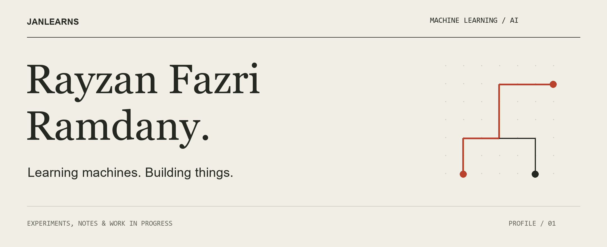
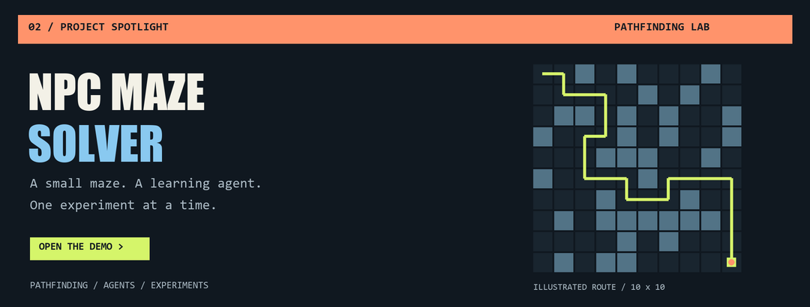



 

[Email](mailto:rayzanfazri@gmail.com) &nbsp; / &nbsp; [LinkedIn](https://www.linkedin.com/in/rayzan-fazri-ramdany-190063291) &nbsp; / &nbsp; [Instagram](https://www.instagram.com/rayzan3_0) &nbsp; / &nbsp; [Repositories](https://github.com/Janlearns?tab=repositories)

 

### A little context

I'm Rayzan, an aspiring machine learning engineer. I'm learning how models work, how to evaluate them, and how to turn experiments into software people can use.

Right now, I'm exploring **deep learning, computer vision, NLP, and autonomous agents**. This profile is a collection of what I'm building and figuring out along the way.

 

### Selected work

#### NPC Maze Solver

A small environment for exploring how an agent learns to navigate a maze. Run the experiment and follow its reward, step count, and progress across episodes.

[Try the demo ↗](https://janlearns.github.io/NPC_maze_project/) &nbsp; / &nbsp; [Explore MiniProject ↗](https://github.com/Janlearns/MiniProject)

See the application

 

 

### On my workbench

| Area | Tools & interests |
| :--- | :--- |
| Models | PyTorch, TensorFlow, Keras, scikit-learn |
| Data | Python, pandas, NumPy · preprocessing & feature engineering |
| Practice | Model evaluation, hyperparameter tuning, Git |
| Learning next | Connecting data pipelines, models, and deployment |

 

---

Interested in building something together? [Drop me a line.](mailto:rayzanfazri@gmail.com)
